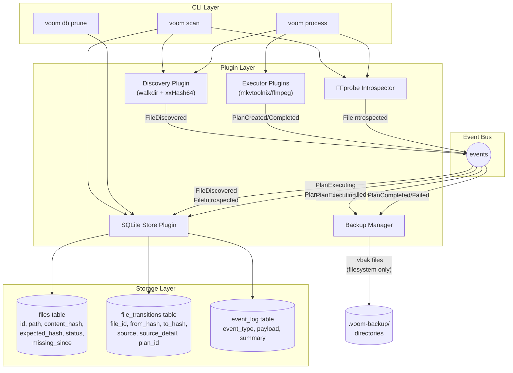
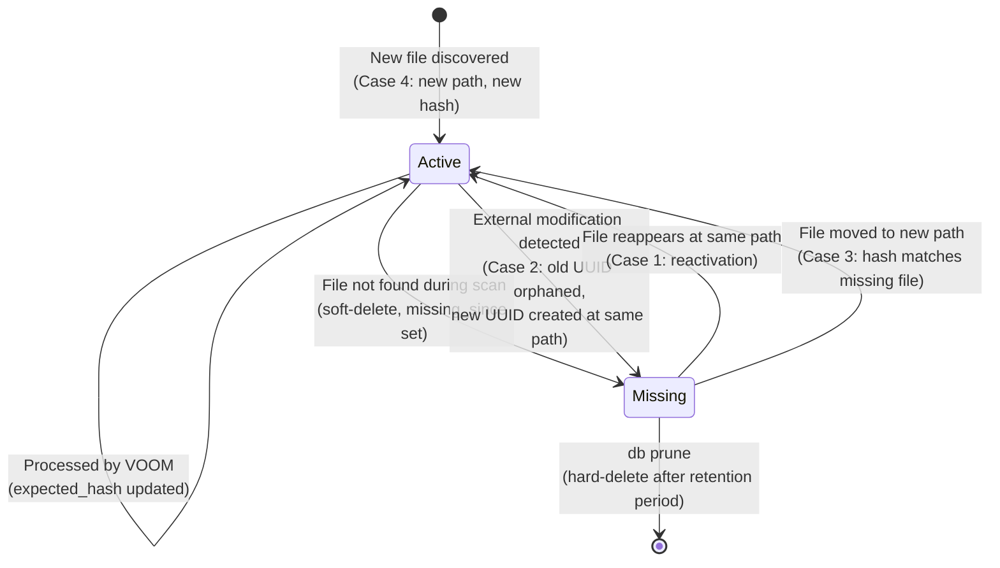
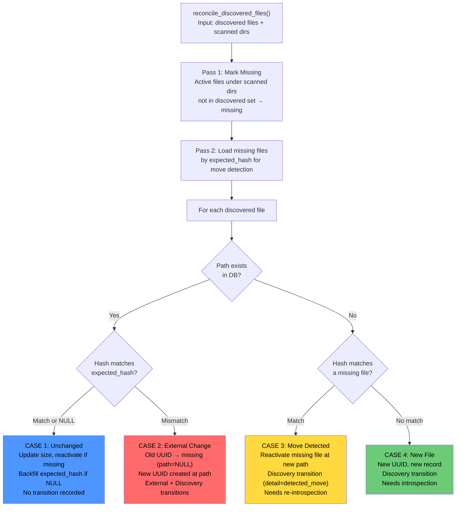
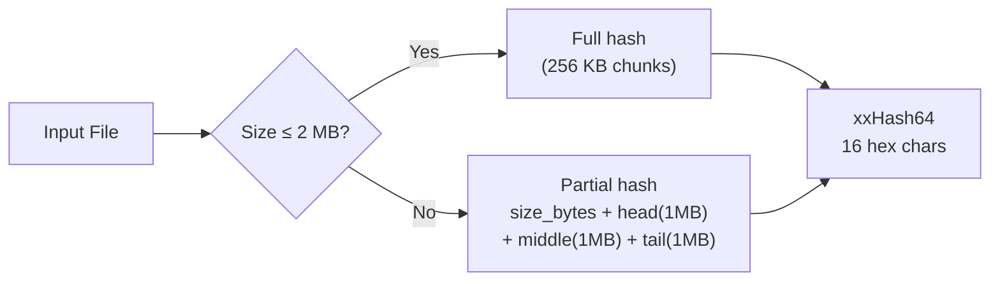
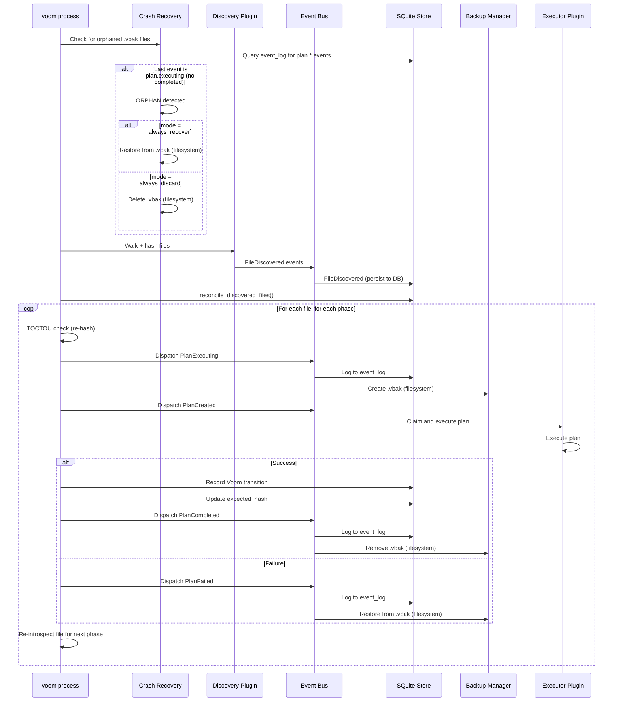

# File Lifecycle Tracking Architecture

> Deep-dive into the implementation of file lifecycle tracking in VOOM.
> Written as an honest assessment: what works, what's fragile, and what will break.

## What This Feature Does

File lifecycle tracking gives VOOM a memory. Without it, every scan is stateless — VOOM discovers files, processes them, and forgets. With lifecycle tracking, VOOM maintains a persistent record of every file it has ever seen, including:

- Whether a file has been **moved**, **modified externally**, **deleted**, or **reappeared**
- A full **transition history** (who changed what, when, and why)
- **Crash recovery** from interrupted processing via orphaned backup detection
- **Expected hash** tracking so VOOM knows when something outside VOOM changed a file

## Architecture Overview

## File State Machine

Every file tracked by VOOM is in one of two states. The transitions between them form the core of lifecycle tracking.

**Only two statuses exist: `Active` and `Missing`.** There is no "processing", "queued", or "error" status. This is a deliberate simplification — the file either exists or it doesn't.

## The Reconciliation Engine

This is the heart of lifecycle tracking. It lives in `reconcile_discovered_files()` (`plugins/sqlite-store/src/store/file_storage.rs:314-606`) and runs inside a single SQLite transaction.

### Key design decisions in reconciliation

**Scoped to scanned directories.** If you scan `/movies` but not `/tv`, files under `/tv` are never marked missing. Move detection also only considers missing files whose last-known path was under a scanned directory. This prevents "identity theft" when a file hash happens to match across libraries.

**External modification creates a new file identity.** When a file at an existing path has a different hash than expected, the old record is orphaned (path cleared, status set to missing) and a brand-new file record is created. This means the UUID changes. The rationale: the content is different, so it's logically a different file. The old record's transition history is preserved.

**Move detection is first-match-wins.** If two new files share a hash that matches a missing file, only the first one gets the move. The second becomes a new file. A `consumed_missing` set tracks this.

**Legacy file handling.** Files with `expected_hash = NULL` (from before this feature existed) are treated as unchanged on first rescan, and their expected_hash is backfilled. This avoids false "external modification" alerts on upgrade.

## Content Hashing Strategy

**Algorithm:** xxHash64 (xxh3 variant) — fast, not cryptographic.

**Partial hashing for large files** samples head, middle, and tail (1 MB each) plus the file size. This keeps hashing fast for multi-GB video files while detecting most content changes.

## Process Command and Crash Recovery Flow

### Crash recovery logic

When `voom process` starts, it scans for `.vbak` files in `.voom-backup/` directories. For each backup found, it queries the event log:

| Last event for path | Interpretation | Action |
|---------------------|----------------|--------|
| `plan.executing` only | Crashed mid-execution | Recover or discard (config) |
| `plan.completed` | Normal retained backup | Leave alone |
| `plan.failed` | Failed but restored | Should already be cleaned up |
| No events | Unknown origin | Leave alone (conservative) |

## Transition Recording

Every meaningful state change is recorded in `file_transitions`:

| Source | Detail | When |
|--------|--------|------|
| `discovery` | (none) | New file found for the first time |
| `discovery` | `detected_move` | File matched a missing file by hash |
| `external` | (none) | File at existing path has different hash |
| `voom` | `mkvtoolnix:normalize` | VOOM processed the file (executor:phase) |
| `voom` | `ffmpeg:transcode` | VOOM processed the file (executor:phase) |

Each transition captures `from_hash`/`to_hash`, `from_size`/`to_size`, and optionally a `plan_id` linking to the Plan that caused it.

## Test Coverage Map

22 functional tests in `test_lifecycle_advanced`:

| Category | Tests | What's Verified |
|----------|-------|-----------------|
| Multi-root scan | 4 | Independent roots, partial rescan scoping, within-root moves, cross-root moves |
| External modification | 3 | Hash change detection, modification + deletion combo, idempotent restore |
| Reactivation/cycling | 3 | Reappearance at same path, reappearance at different path (move), stress iterations |
| Process transitions | 4 | Voom transitions recorded, dry-run records nothing, expected_hash updated, full history via CLI |
| Crash recovery | 3 | Always-recover mode, always-discard mode, normal backups not treated as orphans |
| Statistics/filtering | 2 | Missing files excluded from reports, db prune hard-deletes with cascade |
| Corrupt file handling | 2 | Scan survives corrupt files, process survives corrupt files |
| End-to-end integration | 1 | Scaled corpus with corruption through full pipeline |

---

## Devil's Advocate: Where This Will Break

### 1. Partial hashing will produce false "unchanged" results

The xxHash64 partial hash samples only 3 MB out of potentially multi-GB files. If a change happens in the unsampled middle region (between the sampled middle chunk and the tail), VOOM will not detect it.

**Real scenario:** A tool re-encodes a few seconds of video mid-file without changing the file size. The head, middle-sample, and tail are identical. VOOM sees "unchanged" and skips it. The `expected_hash` never updates, so the modification is invisible forever.

**Severity:** Medium. This is a known tradeoff for performance. Full hashing multi-GB files on every scan is prohibitively slow. But users who care about bit-perfect integrity may be surprised.

**Mitigation:** Offer a `--full-hash` flag for periodic deep scans. Currently not implemented.

### 2. Move detection is hash-based and first-match-wins

If two files have the same content (e.g., same episode re-downloaded, or remux with identical stream data), they produce the same hash. Move detection can match the wrong file.

**Real scenario:** User has `Movie.2024.BluRay.mkv` and `Movie.2024.WEB-DL.mkv`. Both happen to produce the same partial hash (same head/mid/tail from identical video stream). User deletes the BluRay and adds a new file. VOOM "moves" the BluRay identity to the new file instead of creating a fresh record.

**Severity:** Low-Medium. xxHash64 collisions are rare in practice, and the partial hash includes file size. But for the subset of users with large libraries of similar content, this could cause confused identity chains.

**Mitigation:** The corpus generator already deduplicates content signatures to avoid this in tests. Production would benefit from a secondary check (e.g., comparing file sizes or track counts before confirming a move).

### 3. External modification creates identity discontinuity

When VOOM detects an external modification, it orphans the old UUID and creates a new one. This means the transition history splits: the old UUID's history ends at the external change, and the new UUID starts fresh.

**Real scenario:** User uses HandBrake to re-encode a file in place. VOOM detects the hash change, creates a new file identity, and the entire processing history (which phases were applied, which executor was used) is now on a different UUID that's marked missing. If the user runs `voom history` on the file, they see only a single "discovered" transition.

**Severity:** Medium. This is architecturally correct (the content IS different), but the user experience is confusing. "Why did VOOM forget everything about this file?"

**Mitigation:** Implemented via `superseded_by` chain. See [File Identity and Lineage](file-identity-and-lineage.md) for details.

### 4. Crash recovery depends on event log not being pruned

The event log auto-prunes to 10,000 rows. Crash recovery queries the event log to determine if a `.vbak` file is an orphan (last event was `plan.executing` without `plan.completed`).

**Real scenario:** VOOM crashes during processing. Before the user restarts, they run several large scans that generate thousands of events, pushing the crash's `plan.executing` event past the 10,000-row retention limit. On next `voom process`, the orphaned backup has no matching event in the log. Recovery sees "no events" and leaves the backup alone (conservative default). The corrupted file and orphaned backup both persist.

**Severity:** High. The 10,000-row limit is a ticking time bomb for crash recovery. A large library scan can easily generate 10K+ events (one per file discovered + introspected).

**Mitigation:** Either exempt `plan.*` events from pruning, or maintain a separate recovery-specific table that isn't auto-pruned.

### 5. No protection against concurrent scan/process operations

There is no advisory lock, PID file, or flock preventing two VOOM processes from operating on the same library simultaneously.

**Real scenario:** User has a cron job running `voom scan` hourly. They manually run `voom process` while a scan is in progress. Both access the same SQLite database. SQLite handles concurrent readers, but the reconciliation transaction could conflict with the process command's transition recording. At best, one gets a SQLITE_BUSY error. At worst, the reconciliation marks a file as missing that the process command is actively modifying.

**Severity:** High. This is the most likely real-world failure mode for users who automate VOOM.

**Mitigation:** SQLite WAL mode helps with read concurrency, but write conflicts are still possible. Need either a file-based lock or a `running_operations` table.

### 6. Path comparison is string-based, not filesystem-aware

Paths are stored and compared as strings. No normalization is applied for:
- Case sensitivity (macOS HFS+ is case-insensitive by default)
- Unicode normalization (NFC vs NFD — macOS decomposes filenames)
- Trailing slashes
- Symlink resolution (except in tests where `canonicalize()` was explicitly added)

**Real scenario:** User has a file at `/Movies/The Café.mkv`. macOS stores the filename with decomposed Unicode (e + combining accent). An external tool creates a new file with composed Unicode (single e-with-accent character). VOOM sees two different paths. The old file is marked missing, the new one is created as a brand-new file — even though they're the same filesystem path.

**Severity:** Medium on macOS, low on Linux. The Unicode normalization issue is subtle and hard to trigger, but when it does, it produces confusing duplicate entries.

**Mitigation:** Normalize paths through `canonicalize()` and Unicode NFC normalization before storage. Currently only done in test assertions, not in production code.

### 7. TOCTOU gap between hash and reconciliation

The scan command hashes files during discovery, then passes those hashes to reconciliation. There's a time gap between hashing and reconciliation where the file could change.

**Real scenario:** A large library scan takes 30 minutes. During that time, a download completes and overwrites a partially-downloaded file. The hash was computed when the file was partial. Reconciliation stores this partial hash as the expected_hash. Next scan, the file has a different hash (now complete), triggering a false "external modification" alert.

**Severity:** Low. The window is small for any given file (hash → reconcile is fast), and the consequence (false external modification) is recoverable — just triggers re-introspection.

### 8. The lifecycle stress test is non-deterministic

`lifecycle_iteration_stress` randomly deletes or renames files across iterations. It exits early if all files are deleted. The "large" scale preset (10 iterations) with random operations can exhaust all files in 2-3 iterations, making the test a no-op for most of its runtime.

**Severity:** Low (test quality issue, not production). But it means the test provides less coverage than it appears to. Running with `VOOM_TEST_SCALE=large` doesn't necessarily stress the system more — it might just delete everything faster.

### 9. Backup path inference is brittle

Crash recovery infers the original file path from the backup filename by stripping the `.vbak` extension and a 14-digit timestamp suffix. This parsing is position-based.

**Real scenario:** A file named `Movie.2024.12.25.Special.mkv` has digits in its name. The backup is `Movie.2024.12.25.Special.mkv.20260403120000.vbak`. Stripping `.vbak` gives `Movie.2024.12.25.Special.mkv.20260403120000`. Stripping 15 chars (dot + 14 digits) gives `Movie.2024.12.25.Special.mkv` — correct. But if the timestamp format ever changes length, or if the filename contains a dot followed by 14 digits, the inference could fail.

**Severity:** Low. The current format is rigid enough to work. But it's a maintenance hazard — any change to the backup naming scheme breaks recovery.

### 10. Event log summary format is an implicit contract

Crash recovery parses event summaries with format `"path=/some/path phase=some_phase"`. The test suite also parses stderr summary lines with regex. These are implicit contracts — if the format changes, recovery and tests break silently.

**Severity:** Medium. The event summary format is not validated by types or schemas. It's a string that happens to be parsed downstream. A refactor that changes the summary wording breaks crash recovery without any compiler warning.

**Mitigation:** Use structured event payloads (JSON) for machine consumption and summaries for human display only. Recovery should query structured fields, not parse summaries.

---

## Honest Assessment

**Is it spaghetti code?** No. The architecture is clean — clear separation between CLI orchestration, plugin event handling, and storage. The reconciliation engine is a single function with well-defined cases inside a transaction. The state machine has only two states.

**Is it solid?** Mostly. The core scan → reconcile → introspect → process pipeline works correctly for the common cases. The 22 functional tests cover the important scenarios and verify database state directly (not just CLI output).

**Where is it fragile?** The gaps are at the boundaries:
1. **Concurrency** — no locking between parallel VOOM processes
2. **Event log pruning** — can silently break crash recovery
3. **Path normalization** — string comparison on a case-insensitive filesystem
4. **Implicit string contracts** — event summary parsing for crash recovery

The first two are the most likely to cause real user-facing failures. Items 3 and 4 are correctness issues that will manifest as confused file identities on macOS.

**What would it take to ship with confidence?**
1. Add a file-based lock to prevent concurrent operations
2. Exempt `plan.*` events from auto-pruning (or use a dedicated recovery table)
3. Normalize paths before storage (canonicalize + NFC)
4. Parse structured event payloads for recovery, not summary strings
